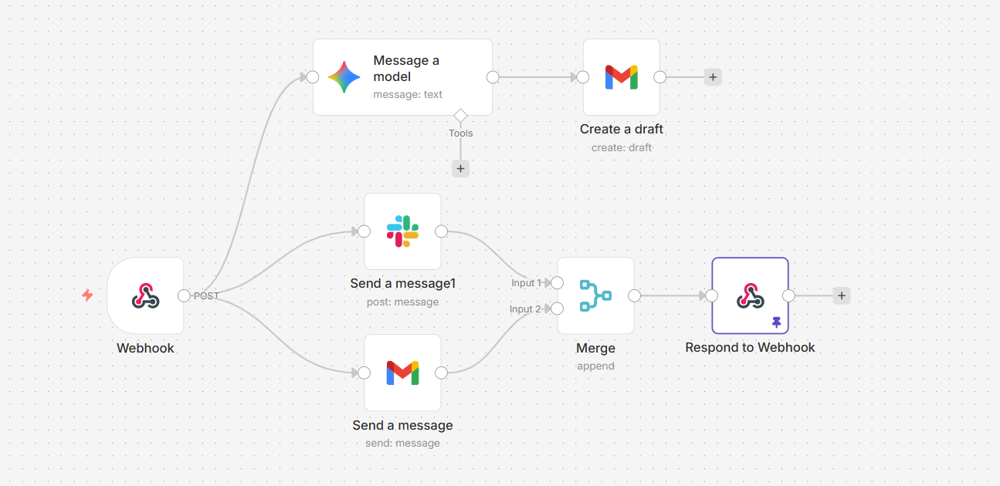

# Portfolio

Personal portfolio site for Yousri Meftah.

## Transparency & Attribution

This project was created with Lovable. It does **not** represent my frontend skill level. I’m a backend/DevOps‑focused engineer, and I want to be clear and honest about that.

## Getting started

```sh
npm i
npm run dev
```

## Contact Form (n8n Workflow)

The contact form posts to an n8n webhook, which then sends notifications and responds to the request.

Workflow summary:



1. **Webhook** — Receives the form submission (POST).
2. **Send a message (Slack)** — Sends a message to Slack.
3. **Send a message (Gmail)** — Sends an email.
4. **Merge** — Combines results.
5. **Respond to Webhook** — Returns a success response to the frontend.

Environment variables:
```
VITE_N8N_WEBHOOK_URL=https://n8n.yousri-meftah.com/webhook/contact
VITE_N8N_WEBHOOK_HEADER_NAME=yousri
VITE_N8N_WEBHOOK_HEADER_VALUE=yousri
```

Notes:
- You can discover the n8n endpoint via DevTools Network, so it’s fine to document it here.
- The custom header is for demonstration only. The workflow only accepts requests from my domain, so it’s not intended to be a spam vector.

## Tech stack

- Vite
- TypeScript
- React
- shadcn-ui
- Tailwind CSS

## Frontend folder structure

```
./src
./src/App.css
./src/App.tsx
./src/components
./src/components/ContactSection.tsx
./src/components/CustomCursor.tsx
./src/components/ExperienceSection.tsx
./src/components/Footer.tsx
./src/components/HeroSection.tsx
./src/components/KonamiCode.tsx
./src/components/Navigation.tsx
./src/components/NavLink.tsx
./src/components/ProjectsSection.tsx
./src/components/SkillsSection.tsx
./src/components/theme-provider.tsx
./src/components/ThemeToggle.tsx
./src/components/ui
./src/data
./src/data/blog.ts
./src/data/portfolio.ts
./src/hooks
./src/hooks/use-mobile.tsx
./src/hooks/use-toast.ts
./src/index.css
./src/lib
./src/lib/utils.ts
./src/main.tsx
./src/pages
./src/pages/Index.tsx
./src/pages/NotFound.tsx
./src/test
./src/test/example.test.ts
./src/test/setup.ts
./src/vite-env.d.ts
```
